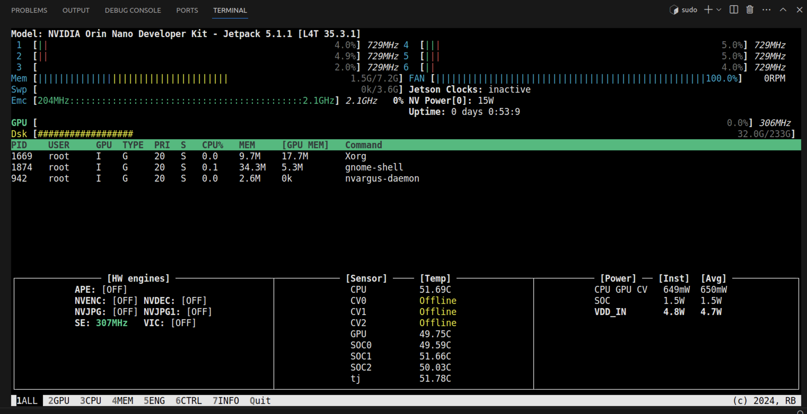

# Sim-to-Real project on Unitree Go2

## Overview 

This repository is forked from [walk-these-ways](https://github.com/Improbable-AI/walk-these-ways), which is a Go1 Sim-to-Real Locomotion Starter Kit. It seems that [walk-these-ways](https://github.com/Improbable-AI/walk-these-ways) can be untilized on Unitree [A1](https://github.com/fan-ziqi/dog_rl_deploy) with simple modifications, since those robots are base on [unitree-legged-sdk](https://github.com/unitreerobotics/unitree_legged_sdk). 

However, the brand-new architecture [unitree-sdk2 ](https://github.com/unitreerobotics/unitree_sdk2)is not based on UDP anymore, so this project aims to train and deploy walk-these-ways on Unitree Go2 by modifying SDK interfaces.

## Requirements 
* miniconda
* pytorch 1.10 with cuda-11.3
* Isaac Gym
* Nvidia GPU with at least 8GB of VRAM

---
## Train and Play
Clone this repository and install:

``` bash
git clone https://github.com/Teddy-Liao/walk-these-ways-go2.git
cd walk-these-ways-go2
pip install -e .
```

Start training: 
```bash
python scripts/train.py
```

`go2_gym` and `go2_gym_learn` folders are the main folders for training process.

Play the model:
```bash
cd scripts
python play.py
```


Go2 pretrained model is provided in [./runs](runs/gait-conditioned-agility/pretrain-go2), you can choose whether to use provide pretrained model by modifying the label line `label = "gait-conditioned-agility/pretrain-go2/train"` to your own trained model.

### Known Issues
* `flip_visual_attachments` in [go2_config](go2_gym/envs/go2/go2_config.py) should be set to `True`, otherwise errors would occur when visualizing.
* To change configuration parameters of env or the robot, you should modify parameters in [go2_config](go2_gym/envs/go2/go2_config.py), not in [legged_robot_config](go2_gym/envs/base/legged_robot_config.py)


---
## Deploy on PC
Trained policy is only supported to be deployed through your PC or laptop now, because I am not familiar with Jetson Orin, and hope I can fix it and deploy on Jetson Orin.

### Requirements
#### Install LCM
Since [walk-these-ways](https://github.com/Improbable-AI/walk-these-ways) implement an interface based on Lightweight Communications and Marshalling ([LCM](https://github.com/lcm-proj/lcm)) to pass sensor data, motor commands, and joystick state between their code and the low-level control SDK provided by Unitree, LCM should be installed firstly in your PC or laptlop.

Clone LCM repository to any location (where you usually place installed softwares), then install LCM:
```bash
git clone https://github.com/lcm-proj/lcm.git
mkdir build
cd build
cmake ..
make
sudo make install
```

#### Unitree_SDK2
unitree_sdk2 has been inclued in `go2_gym_deploy/unitree_sdk2_bin/library/unitree_sdk2`,  you can also clone from [Unitree Robotics](https://github.com/unitreerobotics/unitree_sdk2) to make sure the sdk is updated version.

```bash
cd go2_gym_deploy/unitree_sdk2_bin/library/unitree_sdk2
```
Delete build file
```bash
rm -r build
```
Install and build:
```bash
sudo ./install.sh
mkdir build
cd build
cmake ..
make
```

### Build lcm_position_go2
`go2_gym_deploy/unitree_sdk2_bin/lcm_position_go2.cpp` is the core file of this project, which is similar to `lcm_position.cpp` in [walk-these-ways](https://github.com/Improbable-AI/walk-these-ways), but replace unitree_legged_sdk with unitree_sdk2.

Build lcm_position_go2 and generate runfile `lcm_position_go2`
```bash
cd go2_gym_deploy
rm -r build
mkdir build
cd build
cmake ..
make -j
```

All LCM messages files in `go2_gym_deploy/lcm_types` are set as the same format shown in [walk-these-ways](https://github.com/Improbable-AI/walk-these-ways) to ensure successful connection with python files. LCM message files are provided in this project, and you can also generate customized LCM message files through the following instructions: 

`xxx_lcmt.hpp` files are generated by:
```bash
lcm-gen -x xxx.lcm
```

### Verify connection
Connect your PC/Laptop with Go2 robot with ethernet cable and check connection by:
```bash
ping 192.168.123.161
```

Check the network interface address, and copy the network interface address.
```bash
ifconfig
```
If error occurs, please check [Unitree Support](https://support.unitree.com/home/zh/developer/Quick_start) for details.

### Test communication between LCM and unitree_sdk2
```bash
cd go2_gym_deploy/build
sudo ./lcm_position_go2 enx10086
```
Aeplace `enx10086` with your own network interface address. According to the messages shown in terminal, press `Enter` for several times and the communication between LCM and unitree_sdk2 will set up.

This command will automatically shut down Unitree sport_mode Service and set the robot to LOW-LEVEL. Please make sure This will Go2 is hung up or lie on the ground.

You can verify LCM send by opening a new terminal:
```bash
cd go2_gym_deploy/build
sudo ./lcm_receive
```

### Load and run policy
Open a new terminate and run:
```bash
cd go2_gym_deploy/scripts
python deploy_policy.py
```
According to the hints shown in terminal, Press button [R2] to start the controller. You can check RC mapping in the following subsection.


### Joystick Mapping


To view the details of joystick mapping or even modify default mapping logic, please refer to the `get_command` function within the [cheetah_state_estimator.py](go2_gym_deploy/utils/cheetah_state_estimator.py) file. In this project, the default gait is set to trot.


**Caution**:
* Press [L2+B] to switch to damping mode if any unexpected situation occurs!!!
* This is research code; use at your own risk; we do not take responsibility for any damage.

Test Video on Unitree Go2: 
- Test in my bedroom: https://www.bilibili.com/video/BV1tQ4y1c7ZG/?spm_id_from=333.999.0.0&vd_source=07873ebe2a113dac57775e264a210929
- Test by other contributors: https://www.bilibili.com/video/BV1Ut421H7Fr/?spm_id_from=333.1007.top_right_bar_window_history.content.click&vd_source=07873ebe2a113dac57775e264a210929


---
## Deploy on Nvidia Jetson Orin

The Unitree Go2 robot is equipped with an onboard Nvidia Jetson Orin Nano/NX, which operates on an ARM-based architecture. Default information of this onboard computer is shown below, and you can connnect to Jetson by SSH, VScode(remote development) or plugging a HDMI cable.

```
IP:192.168.123.18
user name：unitree
password：123
```

### Requirements for Jetson
- cuda
- pytorch
- miniconda (Omitted here; please install it by yourself)
- cudnn (Omitted here; please install it by yourself)


Two different ways are provided to set up correct environments in Jetson: through Internet or through Docker.

### Through Internet
Connecting a Nvidia Jetson device to the internet can be done in two primary ways:

1. **Wired Connection**: Directly plug an Ethernet cable with internet access into the Jetson's Ethernet port. This method provides a stable and fast internet connection, suitable for tasks that require high bandwidth or low latency.

2. **Wireless Connection via USB Wi-Fi Adapter**: Purchase a USB Wi-Fi adapter compatible with the Jetson device. This method adds wireless connectivity, offering the flexibility to connect to the internet without the need for physical cables. However, it's important to ensure the USB Wi-Fi adapter is supported by the Jetson's operating system and drivers.


#### Check Jetpack Version
Jetpack toolbox has been preinstalled on Jetson, you should check the jetpack vertsion firstly.
```bash
sudo -H pip install jetson-stats  #Install jetson-stats toolkit
sudo jtop
```
According to the detail information printed in the terminal window, the Jetpack version of my Unitree Go2 is `Jetpack 5.1.1 [L4T 35.3.1]`



You can also check libraries that have been preinstalled: 
```bash
sudo jetson_release
```
#### Install cuda for jetson
Check if there is a preinstalled version of cuda. 
```bash
nvcc -V # check preinstalled cuda version
```

If the preinstalled version if too high, you should uninstall it because, for instance, there is no Pytorch version that is compatible with cuda-12.2.

```bash
sudo apt-get remove cuda
sudo apt autoremove 
sudo apt-get remove cuda*
sudo dpkg -l |grep cuda # check if any residual cuda file exists
sudo dpkg -P Residual filename
```

Personally, I recommend to install cuda-11.8. Click the link, [CUDA Toolkit 11.8 Downloads](https://developer.nvidia.com/cuda-11-8-0-download-archive?target_os=Linux&target_arch=aarch64-jetson&Compilation=Native&Distribution=Ubuntu&target_version=20.04&target_type=deb_local) , to check installation commands.

#### Install Pytorch for Jetson

Please [download](https://forums.developer.nvidia.com/t/pytorch-for-jetson/72048) pre-built PyTorch pip wheel installers for Jetson Nano, which is different from the way we install Pytorch on PC. Note that correct pytorch version should be chosen to make it compatible with specific version of cuda and Jetpack. 

#### Run codes without cable
As long as the environment and requirements on the Jetson are properly configured, you can follow the same deployment guidelines as you would on a PC. This liberates the robot! Now, you can test the code cable-free, offering more freedom to the robot's movements and applications.

### Through Docker

To be continue ...

--- 

🌟🌟🌟  **Please star this repository if it does help you! Many Thanks!** 🌟🌟🌟 


---
## Acknowledgements
* Many thanks to [Leolar](https://github.com/NihaoyaLeolar), who provide Nvidia 3060ti and supporting.
* Many thanks to [Jony](https://github.com/jonyzhang2023) and Peter for their support and encourage me to learn basic kownledge about RL.
* Many thanks to [Simonforyou](https://github.com/Simonforyou), who provide Go2 pretrained model.

---
## TO DO
- [x] Do not inherit config and env from go1_gym, build customized config and env files for Go2
- [x] Deploy on Jeston Orin Nano
- [ ] Deploy through Docker
